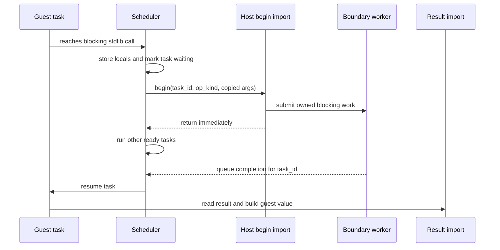

# fix: Lower blocking host I/O through scheduler-aware awaits

## Summary

FAI should treat blocking host I/O as scheduler suspension points, not ordinary imports. The first implementation pass should lower `std.http.request.*` through a reusable host-operation await path, prove that `nowait` tasks interleave while outbound HTTP is in flight, then migrate the next blocking stdlib surfaces through the same substrate.

---

## Problem Frame

`nowait` schedules cooperative tasks, but the scheduler cannot preempt a running guest task while it is inside a synchronous host import. `remoteCall`, `sleep`, and supported FFI already use the right shape: park the task, start host work, return to the scheduler, then resume when the result is ready. `std.http.request.*` currently does the opposite: it emits a direct host import that performs blocking network or file work inline, which can starve sibling `nowait` tasks and HTTP server request handling.

The HTTP fix should be the prototype for a general host-I/O lowering path. The follow-up stdlib migrations should reuse that path instead of adding one-off `AwaitHttp`, `AwaitProcess`, and `AwaitFile` variants with duplicated scheduler plumbing.

---

## Requirements

**HTTP request lowering**

- R1. `std.http.request.get/post/put/patch/delete` must yield the current scheduler task while the native host performs network or `file://` work.
- R2. HTTP request return values and failure behavior must remain compatible with the existing response dictionary and `null` behavior.
- R3. A `nowait` task doing an outbound HTTP request must not block another ready `nowait` task from starting or resuming.
- R4. A background HTTP request started from a server process must not prevent unrelated HTTP server requests from making progress.

**Reusable host-operation substrate**

- R5. Blocking stdlib operations should share one await/result plumbing path where practical.
- R6. Host workers must receive owned, `Send` data copied out of guest memory before the task parks and must never touch the `Store` or guest memory.
- R7. Result materialization must happen back on the scheduler thread after the worker completes.

**Broader migration**

- R8. `std.process.run`, filesystem calls, and raw socket calls should be classified and migrated in priority order after the HTTP path is proven.
- R9. CPU-bound fairness work for array helpers, JSON, and crypto should stay separate from blocking I/O migration.

---

## Key Technical Decisions

- KTD1. **Use a generic host-operation await path:** Add a reusable scheduler term and host import pair for blocking host operations instead of adding HTTP-only async plumbing. This preserves one mental model for HTTP, process, file, and later socket work.
- KTD2. **Keep worker boundaries Store-free:** Follow the existing `remote_begin` and `ffi_begin` boundary pattern: copy arguments out, run blocking Rust work on a worker, queue an owned result, resume the guest, and build guest values only after resumption.
- KTD3. **Prove with behavior before broad migration:** Start with failing HTTP interleaving and server responsiveness tests. Only after those pass should the plan migrate `std.process`, `std.file`, and sockets.
- KTD4. **Treat sockets as a special migration:** Raw sockets have handle and registry ownership constraints, so they should use the same await concept but may need a registry design change before worker offload is safe.
- KTD5. **Keep CPU monopolization separate:** Large `std.array` callbacks, JSON parse/stringify, and crypto can monopolize a scheduler turn, but they need yield/preemption policy rather than blocking-I/O worker offload.

---

## High-Level Technical Design

The important invariant is that the worker never receives a `Caller`, `Store`, `Memory`, or guest pointer. It receives owned Rust data and returns owned Rust data. The resume path translates that data back into FAI values on the scheduler thread.

---

## Implementation Units

### U1. Add HTTP scheduler-blocking characterization tests

- **Goal:** Capture the current failure before changing the lowering path.
- **Requirements:** R1, R3, R4
- **Dependencies:** None
- **Files:** `crates/fai-feature-tests/tests/async_host_io.rs`, `crates/fai-feature-tests/tests/http_concurrency.rs`, `tests/fixtures/language/async_engine/nowait_http_request_yields/main.fai`
- **Approach:** Add one small app that starts two `nowait` loops where one loop performs `std.http.request.get` against a delayed local test server and the other loop logs or increments before the response completes. Add a server-oriented regression where a background `nowait` HTTP request is active while an unrelated quick route is requested.
- **Patterns to follow:** `crates/fai-feature-tests/tests/rpc_offload.rs`, `crates/fai-feature-tests/tests/http_concurrency.rs`, existing `async_engine` fixture style.
- **Test scenarios:**
  - Start delayed outbound HTTP in one `nowait`; expect a sibling logger task to run before the delayed response finishes.
  - Start delayed outbound HTTP from a server-backed background task; expect a quick route to return within a threshold that is well below the delayed upstream response time.
  - Exercise at least one body-bearing verb after lowering so argument copying covers URL, body, and headers.
- **Verification:** The tests fail against the current direct import behavior and pass only once HTTP request work parks the task.

### U2. Introduce reusable async host-operation lowering

- **Goal:** Add the compiler/runtime substrate that lets stdlib calls park a task and resume with an owned result.
- **Requirements:** R5, R6, R7
- **Dependencies:** U1
- **Files:** `crates/fai-codegen-wasm/src/async_analysis.rs`, `crates/fai-codegen-wasm/src/direct.rs`, `crates/fai-codegen-wasm/src/runtime.rs`, `crates/fai-cli/src/wasm_runner/host/boundary.rs`, `crates/fai-cli/src/wasm_runner/host/mod.rs`, `crates/fai-cli/src/wasm_runner/mod.rs`
- **Approach:** Generalize the existing `AwaitRemote` and `AwaitFfi` shape into a host-operation await path that stores continuation state, invokes a begin import, returns to the scheduler, and reads the completed result after resume. Keep operation-specific argument packing and result decoding thin so each migrated stdlib surface supplies only its operation kind and typed payload.
- **Patterns to follow:** `Term::AwaitRemote`, `Term::AwaitFfi`, `remote_begin`/`remote_result`, `ffi_begin`/`ffi_result`, and the boundary worker queue.
- **Test scenarios:**
  - Codegen for a function containing a lowered blocking host op emits a waiting task state and a return after the begin import.
  - Async analysis marks selected stdlib calls as suspension points without marking unrelated pure stdlib calls.
  - A mocked host-operation completion resumes the correct task and binds the completed value.
- **Verification:** Unit tests prove the lowering shape independently of HTTP, and existing `remote_begin`/`ffi_begin` tests still pass.

### U3. Migrate `std.http.request.*` to the host-operation path

- **Goal:** Make native HTTP requests non-blocking from the scheduler's perspective while preserving current API behavior.
- **Requirements:** R1, R2, R3, R4, R6, R7
- **Dependencies:** U2
- **Files:** `crates/fai-codegen-wasm/src/direct.rs`, `crates/fai-codegen-wasm/src/runtime.rs`, `crates/fai-cli/src/wasm_runner/host/net.rs`, `crates/fai-cli/src/wasm_runner/host/boundary.rs`, `crates/fai-compiler/src/ownership_abi.rs`, `crates/fai-feature-tests/tests/async_host_io.rs`, `crates/fai-feature-tests/tests/http_concurrency.rs`
- **Approach:** Replace direct `std.http.request.*` import emission with the new await path. The begin side copies URL, optional body, and headers into owned Rust data; the worker performs the existing `do_verb` behavior without access to guest memory; the result side materializes the response dictionary or `null` after the task resumes.
- **Patterns to follow:** Existing HTTP response construction in `host/net.rs`, ownership ABI entries for fresh response dictionaries, and `rpc_offload` timing assertions.
- **Test scenarios:**
  - `GET` against a delayed local HTTP server yields to another `nowait` task before completion.
  - `POST` with body and headers preserves response status/body/header behavior.
  - Failed network request still returns the same `null`-style behavior as the current import.
  - `file://` GET and write-like verbs preserve existing local file behavior while no longer blocking the scheduler thread.
  - Server quick-route regression stays responsive while background outbound HTTP waits.
- **Verification:** HTTP characterization tests pass, existing HTTP request tests remain compatible, and ownership/leak checks for response dictionaries do not regress.

### U4. Maintain runtime target and documentation parity

- **Goal:** Keep generated runtime stubs, docs, and compile targets coherent after the import shape changes.
- **Requirements:** R1, R2, R5
- **Dependencies:** U3
- **Files:** `crates/fai-cli/src/lib.rs`, `crates/fai-cli/src/doc.rs`, `crates/fai-checker/src/builtins/mod.rs`, `crates/fai-codegen-wasm/src/runtime.rs`
- **Approach:** Update browser/runtime JS import stubs if the native import set changes, and revise docs that currently describe `std.http.request` as synchronous. Keep browser behavior explicit if browser-side request support remains stubbed or separate from native.
- **Patterns to follow:** Existing generated runtime JS tests and stdlib doc entries.
- **Test scenarios:**
  - Generated runtime JS still includes all imports required by wasm modules using `std.http.request`.
  - `fai doc std.http.request` no longer promises scheduler-blocking synchronous behavior.
  - Browser-target stubs fail or no-op in the same user-visible way they did before unless this unit intentionally adds browser support.
- **Verification:** Runtime generation tests pass and docs accurately describe scheduler behavior.

### U5. Migrate process and filesystem operations through the same substrate

- **Goal:** Apply the proven host-operation path to the next blocking native stdlib calls.
- **Requirements:** R5, R6, R7, R8
- **Dependencies:** U3, U4
- **Files:** `crates/fai-codegen-wasm/src/async_analysis.rs`, `crates/fai-codegen-wasm/src/direct.rs`, `crates/fai-cli/src/wasm_runner/host/process.rs`, `crates/fai-cli/src/wasm_runner/host/io.rs`, `crates/fai-cli/src/wasm_runner/host/env.rs`, `crates/fai-feature-tests/tests/async_host_io.rs`
- **Approach:** Migrate `std.process.run` first because it can block until timeout. Then migrate `std.file.read`, `std.file.write`, `std.file.list`, and `std.env.load`; leave cheap probes like `file.exists` lower priority unless the shared path makes them nearly free to include.
- **Patterns to follow:** The HTTP implementation from U3 and existing process/file result encoding.
- **Test scenarios:**
  - A `nowait` task running a slow `std.process.run` yields while another task advances.
  - A timed-out process run preserves JSON fields and timeout semantics.
  - Large file read/write/list operations return the same values and yield around blocking filesystem work.
  - `env.load` preserves dotenv parsing behavior while avoiding scheduler-thread file reads.
- **Verification:** Process/file behavior tests pass, plus interleaving tests prove these calls no longer monopolize the scheduler.

### U6. Design and migrate raw socket waits

- **Goal:** Bring raw socket reads/accepts/connects under scheduler-aware waits without unsafe registry sharing.
- **Requirements:** R5, R6, R7, R8
- **Dependencies:** U3
- **Files:** `crates/fai-cli/src/wasm_runner/host/socket_registry.rs`, `crates/fai-cli/src/wasm_runner/host/sockets.rs`, `crates/fai-codegen-wasm/src/direct.rs`, `crates/fai-codegen-wasm/src/runtime.rs`, `crates/fai-feature-tests/tests/async_host_io.rs`
- **Approach:** Treat sockets as a design checkpoint before implementation. Decide whether to use cloned socket handles on workers, nonblocking readiness, or registry-owned wait jobs that never expose guest memory. Migrate `tcp.accept`, `tcp.connect`, `tcp.read`, `tcp.readLine`, and `udp.receive` once the handle ownership story is explicit.
- **Patterns to follow:** `socket_registry.rs` handle lifecycle, server event-loop readiness handling, and the host-operation result pattern from U3.
- **Test scenarios:**
  - `tcp.accept` waiting for a client yields to another `nowait` task.
  - `tcp.readLine` waiting for a newline yields until data arrives.
  - `udp.receive` waiting for a datagram yields until data arrives.
  - Socket close while an operation is pending produces a deterministic failure result without leaking handles.
- **Verification:** Socket tests prove interleaving and handle cleanup under pending operations.

### U7. Add migration guardrails and final regression sweep

- **Goal:** Make the new scheduler contract visible and prevent future blocking stdlib imports from slipping in unnoticed.
- **Requirements:** R5, R8, R9
- **Dependencies:** U3, U5, U6
- **Files:** `crates/fai-codegen-wasm/src/direct.rs`, `crates/fai-codegen-wasm/src/async_analysis.rs`, `crates/fai-cli/src/doc.rs`, `tests/fixtures/language/README.md`, `crates/fai-feature-tests/tests/async_host_io.rs`
- **Approach:** Add a small classification table or helper for stdlib call blocking risk so new host imports must choose direct, await-host-op, or CPU-bound/direct. Document that `nowait` interleaves at suspension points and that blocking host I/O is expected to lower through the host-operation path.
- **Patterns to follow:** Existing module call resolver tables and async analysis tests.
- **Test scenarios:**
  - A new blocking-operation classification test fails if a known blocking stdlib call resolves as a direct import.
  - Pure or CPU-bound calls remain direct unless a separate fairness design is introduced.
  - Existing async fixtures still pass, including `sleep`, `remoteCall`, and FFI offload coverage.
- **Verification:** The workspace test suite passes, focused async host-I/O tests pass, and docs match the implemented contract.

---

## Acceptance Examples

- AE1. Given two `nowait` tasks where task A calls delayed `std.http.request.get` and task B logs immediately, when the scheduler runs, task B logs before task A receives the HTTP response.
- AE2. Given a running FAI HTTP server with a background task waiting on outbound HTTP, when a client requests a quick local route, the quick route responds before the outbound HTTP delay completes.
- AE3. Given a body-bearing HTTP request with headers, when the request completes, the FAI response dictionary has the same status/body/header shape as before the lowering change.
- AE4. Given a slow `std.process.run` after HTTP lowering is proven, when it runs in a `nowait` task, sibling tasks continue to make progress.

---

## Scope Boundaries

### In Scope

- Native scheduler-aware lowering for blocking host I/O, beginning with `std.http.request.*`.
- A reusable host-operation await path that can support HTTP, process, file, env, and socket migrations.
- Focused feature tests that prove interleaving behavior rather than only asserting generated imports.

### Deferred to Follow-Up Work

- CPU-bound fairness for `std.array` closure helpers, `std.json`, and `std.crypto`.
- True thread/process isolation for `nowait` tasks. This plan improves cooperative scheduling around blocking I/O but does not make guest code preemptive.
- Browser-side HTTP client feature expansion unless required by import-shape parity.

---

## Risks & Dependencies

- **Result ownership:** HTTP response dictionaries are heap values with ownership expectations. The result import must materialize values on the scheduler thread and keep existing ownership ABI behavior intact.
- **Header serialization:** Headers currently cross as guest values. The begin import must copy them into owned Rust data before returning.
- **Scheduler reentrancy:** The new host-operation path should not introduce nested scheduler drives. It should park and return like `remote_begin`.
- **Socket migration complexity:** Socket handles are stateful and may not fit the simple owned-work model without registry changes.
- **Test flakiness:** Timing assertions should use delayed local servers and conservative thresholds, following the style of existing RPC offload tests.

---

## Sources / Research

- `crates/fai-codegen-wasm/src/direct.rs` contains the current `AwaitRemote`/`AwaitFfi` lowering patterns and the direct `std.http.request.*` emission.
- `crates/fai-codegen-wasm/src/async_analysis.rs` currently recognizes `sleep`, `all`, `remoteCall`, user calls, and closure calls as async causes, but not blocking stdlib calls.
- `crates/fai-cli/src/wasm_runner/host/boundary.rs` documents the worker-pool rule that workers must not touch `Store` or guest memory.
- `crates/fai-cli/src/wasm_runner/host/net.rs` currently performs HTTP request and `file://` work inline.
- `crates/fai-cli/src/wasm_runner/host/process.rs`, `host/io.rs`, and `host/socket_registry.rs` contain the next blocking stdlib surfaces to migrate.
- `crates/fai-feature-tests/tests/rpc_offload.rs` is the strongest existing timing-proof pattern for host work that overlaps scheduler progress.
